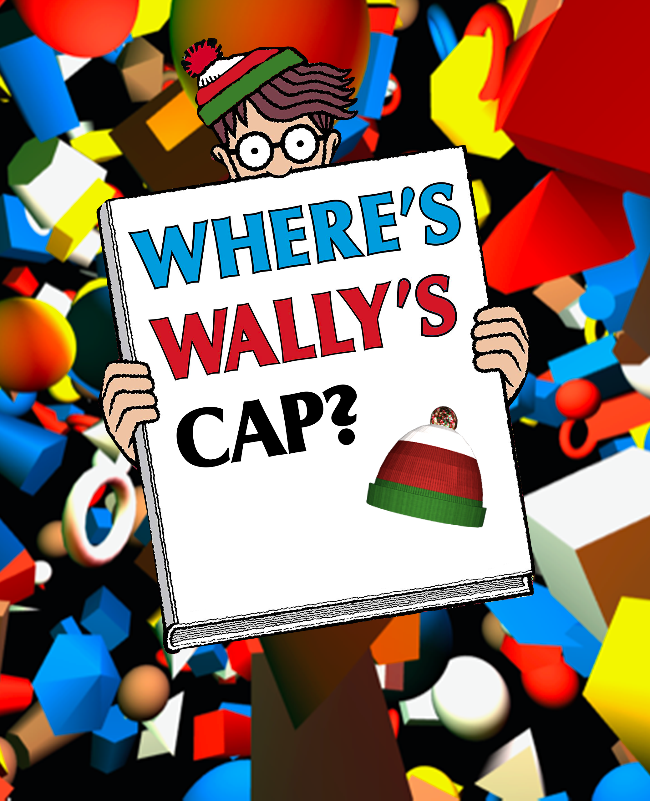

# Where Is Wally Cap 3D?
Final project Carnicella - Interactive Graphics 2020/2021.

    

## 👨‍🏫 Student info
-   Email: carnicella.1915407@studenti.uniroma1.it
-   Student: Alessandro Carnicella 1915407

## 📃 Documentation

-   Documentation of the project [[Doc]](./Documentation.pdf)

## 🕹️ Game Movement

- `up` `down` `left` `right` : camera inclination
- `W` `A` `S` `D`: camera  movement
- `Mouse`: camera inclination
- `Mouse click`:  check object

## 🖥️ Online play
### [Click here to play](https://sapienzainteractivegraphicscourse.github.io/final-project-carnicella/)

## 📚 Libraries

-  THREE.js [Link](https://threejs.org/) [Three.js documentation [Doc](https://threejs.org/docs/)]
